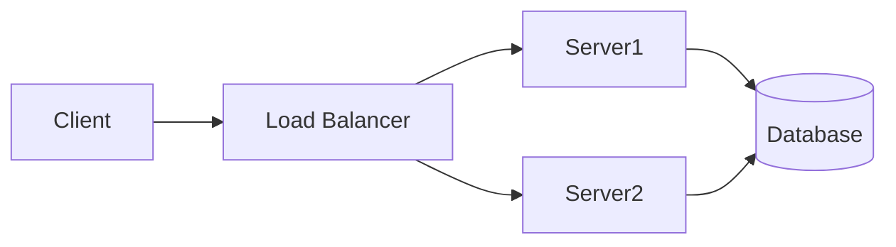
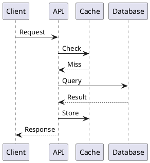

# Tools & Visualization Software

```
╔══════════════════════════════════════════════════════════════════════════════╗
║                     DESIGN & VISUALIZATION TOOLS                              ║
║                Software for Creating System Architectures                     ║
╚══════════════════════════════════════════════════════════════════════════════╝
```

## Diagramming Tools

### Excalidraw (Recommended for Interviews)
**URL**: https://excalidraw.com/
**Cost**: Free
**Best For**: Quick sketching, whiteboard-style diagrams

**Why Use It**:
- Hand-drawn style looks natural
- Very fast to use
- Great for real-time interviews
- No account needed
- Export to PNG/SVG

```
Excalidraw is PERFECT for interviews because:
├── Looks like natural whiteboard drawing
├── Fast enough for timed interviews
├── No learning curve
└── Interviewers love the clean style
```

---

### Draw.io / Diagrams.net
**URL**: https://app.diagrams.net/
**Cost**: Free
**Best For**: Professional architecture diagrams

**Why Use It**:
- Huge shape library (AWS, GCP, Azure icons)
- Integrates with Google Drive, GitHub
- More polished than Excalidraw
- Great for documentation

---

### Lucidchart
**URL**: https://www.lucidchart.com/
**Cost**: Freemium (paid for full features)
**Best For**: Team collaboration, professional diagrams

**Why Use It**:
- Real-time collaboration
- AWS/GCP architecture templates
- Professional appearance
- Great for documentation

---

### Miro
**URL**: https://miro.com/
**Cost**: Freemium
**Best For**: Collaborative whiteboarding

**Why Use It**:
- Great for remote interviews
- Infinite canvas
- Real-time collaboration
- Many templates

---

### Whimsical
**URL**: https://whimsical.com/
**Cost**: Freemium
**Best For**: Flowcharts, mind maps

**Why Use It**:
- Beautiful default styling
- Very fast to use
- Good for quick diagrams

---

## Cloud Architecture Tools

### AWS Architecture Icons
**URL**: https://aws.amazon.com/architecture/icons/
**Cost**: Free
**Best For**: AWS architecture diagrams

Download the icon pack and use with Draw.io or other tools.

---

### GCP Architecture Icons
**URL**: https://cloud.google.com/icons
**Cost**: Free
**Best For**: GCP architecture diagrams

---

### Azure Architecture Icons
**URL**: https://docs.microsoft.com/en-us/azure/architecture/icons/
**Cost**: Free
**Best For**: Azure architecture diagrams

---

### Cloudcraft
**URL**: https://www.cloudcraft.co/
**Cost**: Freemium
**Best For**: 3D AWS architecture diagrams

**Special Feature**: Import from actual AWS account

---

## Code-Based Diagramming

### Mermaid
**URL**: https://mermaid.js.org/
**Cost**: Free
**Best For**: Diagrams as code, version-controlled diagrams



**Why Use It**:
- Embed in Markdown (GitHub renders it!)
- Version control friendly
- Great for documentation

---

### PlantUML
**URL**: https://plantuml.com/
**Cost**: Free
**Best For**: UML diagrams, sequence diagrams



**Why Use It**:
- Standard UML support
- Great for sequence diagrams
- Integrates with many tools

---

### Structurizr
**URL**: https://structurizr.com/
**Cost**: Freemium
**Best For**: C4 model diagrams

**Why Use It**:
- Structured architecture documentation
- Multiple diagram levels from same model
- Professional appearance

---

## Interview-Specific Recommendations

```
┌─────────────────────────────────────────────────────────────────────────────┐
│                    TOOL RECOMMENDATIONS BY SCENARIO                          │
│                                                                              │
│  LIVE INTERVIEW (shared screen):                                            │
│  ├── Best: Excalidraw                                                       │
│  ├── Why: Fast, intuitive, no login                                        │
│  └── Backup: Google Drawings                                                │
│                                                                              │
│  TAKE-HOME ASSIGNMENT:                                                      │
│  ├── Best: Draw.io with cloud icons                                        │
│  ├── Why: Professional, detailed, polished                                 │
│  └── Also good: Lucidchart                                                 │
│                                                                              │
│  DOCUMENTATION:                                                             │
│  ├── Best: Mermaid (in Markdown)                                           │
│  ├── Why: Version controlled, lives with code                              │
│  └── Also good: Draw.io, Structurizr                                       │
│                                                                              │
│  PRACTICING ALONE:                                                          │
│  ├── Best: Paper + pen (seriously!)                                        │
│  ├── Why: Forces you to think, no tool distractions                       │
│  └── Also good: Excalidraw                                                 │
│                                                                              │
└─────────────────────────────────────────────────────────────────────────────┘
```

## Learning & Simulation Tools

### Redis Commander
**URL**: https://github.com/joeferner/redis-commander
**Best For**: Learning Redis data structures

---

### Kafka Tools (Conduktor)
**URL**: https://www.conduktor.io/
**Best For**: Learning Kafka concepts

---

### DB Fiddle
**URL**: https://www.db-fiddle.com/
**Best For**: Testing SQL queries

---

### JSON Formatter
**URL**: https://jsonformatter.org/
**Best For**: Working with API responses

---

## Collaboration Tools for Mock Interviews

### CoderPad
**URL**: https://coderpad.io/
**Best For**: Mock interviews with drawing

---

### Pramp
**URL**: https://www.pramp.com/
**Best For**: Free peer mock interviews (has drawing board)

---

### Google Jamboard
**URL**: https://jamboard.google.com/
**Best For**: Quick collaborative whiteboarding

---

## My Setup Recommendation

```
┌─────────────────────────────────────────────────────────────────────────────┐
│                    RECOMMENDED TOOL SETUP                                    │
│                                                                              │
│  INSTALL/BOOKMARK:                                                          │
│  ─────────────────                                                          │
│  1. Excalidraw (bookmark - no install needed)                              │
│  2. Draw.io (bookmark or VS Code extension)                                │
│  3. Download AWS icon pack                                                  │
│  4. Mermaid extension for your editor                                      │
│                                                                              │
│  PRACTICE WITH:                                                             │
│  ──────────────                                                             │
│  - Excalidraw for timed practice (45 min sessions)                        │
│  - Draw.io for detailed designs                                            │
│  - Paper for understanding (no tools!)                                     │
│                                                                              │
│  FOR THE ACTUAL INTERVIEW:                                                  │
│  ─────────────────────────                                                  │
│  - Whatever they provide (often their own tool)                            │
│  - Excalidraw if you can choose                                            │
│  - Physical whiteboard if on-site                                          │
│                                                                              │
└─────────────────────────────────────────────────────────────────────────────┘
```

## Tool Practice Tips

### Before Your Interview

1. **Practice with the tool**: Don't learn during interview
2. **Know keyboard shortcuts**: Speed matters
3. **Have templates ready**: Common patterns (LB → Service → DB)
4. **Test screen sharing**: Make sure it works

### During Interview

1. **Start with boxes and labels**: Don't worry about icons initially
2. **Add arrows for data flow**: Show direction
3. **Label everything**: Names on services, data flows
4. **Keep it simple**: Clarity > beauty

---

**Next**: [Practice Platforms](./practice_platforms.md) - Where to practice system design
